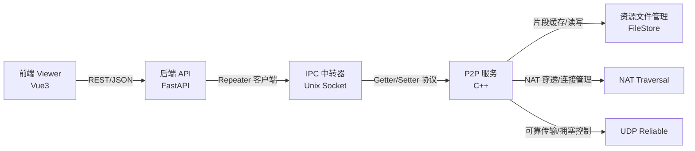
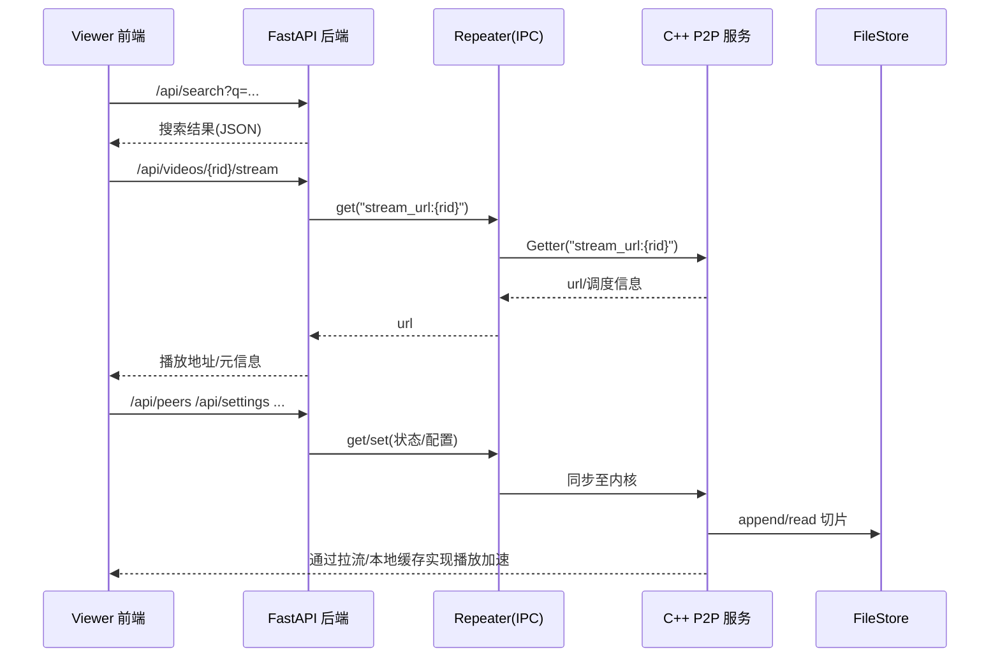

3. 系统设计

本系统旨在构建一套面向视频分发场景的端到端 P2P 加速体系，提供从前端播放、后端编排到本地节点传输及资源管理的完整闭环。系统总体采用“浏览器前端 + Python Web 后端 + C++ P2P 服务 + 进程间中转器”的分层解耦架构，通过 Unix Domain Socket 的轻量 IPC 统一内外部数据面，结合 NAT 穿透与基于 UDP 的可靠传输子系统，形成低时延、可扩展的混合内容分发路径。

系统总体结构如下所示：

数据与控制流程（简化）如下：

3.2 功能模块设计
	自顶向下；

在系统的功能分解上，前端用户界面承担了用户交互与状态可视化的职责，其围绕搜索、播放、Peer 管理与系统设置四类场景展开，以统一的路由与组件化视图组织应用流程。当用户发起检索与播放请求时，请求通过浏览器代理转发至后端 API，由后端完成语义解析与服务编排。播放页面在呈现传统视频控制能力的同时，以半秒级的时间分辨率提供节点数量、上下行速率等关键运行指标的即时反馈，这些指标来自底层 P2P 服务的运行统计并经由 IPC 中转器汇聚，从而在不暴露实现细节的情况下增强用户对系统状态的感知与信任。

Web 后端采用 FastAPI 实现，其核心作用在于以稳定的 REST 接口向上承诺清晰的业务语义，并对下屏蔽复杂的网络与系统细节。系统启动阶段，后端可基于内置的模拟数据完成自洽运行，保证在 P2P 内核尚未就绪或离线的场景下依然具备可演示性与可测试性。当中转器可用且内核在线时，后端通过 Repeater 客户端与 C++ 服务建立稳定的进程间数据通道，将“搜索、视频元信息、Peer 列表、历史与设置”等资源统一抽象为字段化的 getter/setter 交互，既满足跨语言集成的工程性诉求，又使得接口演进与灰度发布具备较低的耦合成本。

IPC 中转器作为 Python 与 C++ 之间的轻量桥梁，选择 Unix Domain Socket 作为传输介质，并以固定头结构的报文封装最小必要语义，即操作类型、字段标识与数据长度。中转器维护一个字段注册中心，用以将字段名映射至具体的读写处理逻辑。通过对字段命名进行前缀化与语义稳定设计（例如 peer、net、cfg 与 video 等命名域），系统在协议演进时能够以增量方式扩展字段并保持向后兼容，从而在不破坏既有调用关系的前提下逐步提升功能覆盖度与可观测性。

P2P 内核承担了对等发现、会话建立、分片调度与数据交换的主体责任。其一方面与 NAT 穿透子系统协同完成可达路径的建立与维持，另一方面将数据面的可靠性委托给基于 UDP 的可靠传输子系统，从而在保持低开销与低时延的同时获得接近 TCP 的有序与可靠能力。内核在调度层采用稀缺度优先与热点感知相结合的策略，依据链路质量与拥塞反馈动态调整并发连接与请求窗口；在面临高丢包或 RTT 波动时，调度策略能够自适应地降低负载或切换路径，并通过 Repeater 将关键链路指标上报后端，以支撑前端的实时状态展示与事后诊断。

资源文件管理模块实现了以文件为粒度的本地切片缓存与元信息维护。模块以独立的二进制元数据文件记录每一资源的最近修改时间与存储占用，支持顺序追加与区间读取等关键操作，并通过容量上限与按最近修改时间驱动的淘汰策略实现近似 LRU 的空间管理。在并发控制方面，模块通过互斥保护元信息字典与打开句柄表，并由后台线程周期性回收空闲文件描述符，以降低资源占用并避免句柄泄漏。写入路径在触达容量上限时触发逐文件淘汰直至满足新增空间需求，保证了长时间运行与高并发场景下的稳定性与可预期行为。

3.1.1 用户界面服务设计
	
用户界面以路由驱动的单页应用形式组织，围绕“首页检索—结果筛选—播放体验—运行观测—历史留存—参数配置”的主线展开。首页承担入口聚合与行为引导的功能，搜索结果页面以信息密度与视觉层次的平衡为目标，提供直达播放的操作路径。播放页面在控制条之外强调运行态的可视化，通过周期性拉取后端聚合指标以贴近网络瞬态；Peer 管理页面呈现系统视角的局部拓扑与节点侧指标，并允许对节点参与与否进行开关控制；历史页面将用户行为与网络观测数据进行轻量整合，支持从记录的时间点继续播放以提升任务连续性；设置页面对上传限速、本地缓存上限、并发线程数与是否启用 P2P 等关键参数予以显式化，形成用户与系统之间的可理解契约。

3.1.2 进程间数据中转传输
	
中转器以最小可行的协议面向进程间通信场景提供稳定、可扩展与易调试的通道。其报文以固定长度的消息头承载操作类型、字段与负载长度，从而在解析复杂度与扩展灵活度之间取得平衡。为适配跨语言与多样化数据类型，消息体被设计为原始字节流，具体的编码细节交由调用方约定。C++ 侧通过字段注册中心将系统内部状态与控制面以字段化接口形式暴露，Python 侧使用 Repeater 客户端进行统一的 `_send(func, field, data)` 调用，二者共同构成了隐含“接口契约—字段演进—版本兼容”的协作机制。得益于命名域的前缀化约定，系统能够在不破坏既有消费者的情况下逐步引入新的观测与控制字段，支撑前后端快速协同演进。

3.1.3 点对点通信模块
	
点对点通信模块通过邻居管理、路径选择与分片调度共同支撑数据面的高效传输。节点在接入后首先完成邻居发现与初始连接的建立，并依据可用带宽、往返时延与丢包等指标计算连接的边际收益，从而确定并发连接数量与优先级。分片层面，系统将内容划分为细粒度的区块并维护位图，结合稀缺度与热点权重构建请求序列，以实现带宽利用率与首帧时延之间的均衡。当链路质量出现恶化时，模块触发重试、降级或路径切换，并将关键统计指标以字段形式暴露给中转器和后端。通过这种“调度—传输—观测”的闭环设计，系统在复杂网络条件下仍能维持可接受的播放连续性与画质稳定性。

3.1.4 资源文件管理模块
	
资源文件管理以工程化的文件抽象承载切片缓存，强调可预测的时空行为与长期运行的稳定性。系统在启动阶段加载元信息并计算已用空间，在运行期间对每次写入进行原子化的元信息更新与使用量累加，确保崩溃恢复后的数据一致性。为避免文件描述符长期占用造成资源压力，后台线程以固定频率检查并关闭空闲句柄；当新增写入造成容量超限时，按照最近修改时间顺序逐一淘汰，直至释放足够空间。上述机制使得缓存层具备“按需生长、轻量维护、成本可控”的特性，为上层的拉流与回源策略提供稳定的持久化支撑。

3.1.5 NAT穿透模块
	
NAT 穿透模块面向复杂网络环境下的可达性挑战，通过识别自身 NAT 类型并选择相应的打洞与保活策略，为数据面提供更短与更稳定的直连路径。系统在接入阶段执行外网可达性探测，并结合可选的信令或中继服务完成候选地址的收集与筛选。在路径选择过程中，穿透模块与调度层共享链路质量与连通性信息，使得上层能够优先选择延迟与丢包更优的直连通道；当直连不可达或品质退化时，系统回退至备选路径并维持最小化的切换开销。与此同时，模块将自身 NAT 类型与打洞状态以字段方式上报后端，用于在管理界面呈现网络环境对系统行为的影响，从而为运维与用户理解提供依据。

3.1.6 基于UDP的可靠通信
	
基于 UDP 的可靠通信子系统在保持 UDP 低开销优势的前提下，引入序号、滑动窗口与重传等机制以提供接近 TCP 的有序与可靠保证。系统以 RTT 估计驱动超时控制，并在检测到丢包或乱序时通过快速重传与缓冲重组恢复数据连续性。拥塞控制方面，子系统结合慢启动与拥塞避免策略对发送窗口进行动态调整，在检测到拥塞事件时实施窗口收缩并逐步探测可用带宽。为降低系统调用与协议头开销，传输层在满足底层 MTU 约束的前提下对小包进行聚合，并对大块数据进行合理分片。传输子系统与调度层共享链路统计指标，并通过中转器对外暴露关键观察量，使上层能够在拥塞与抖动上升时及时降低并发或切换路径，最终以“端到端”的方式改善播放的启动时延、卡顿率与平均画质。

