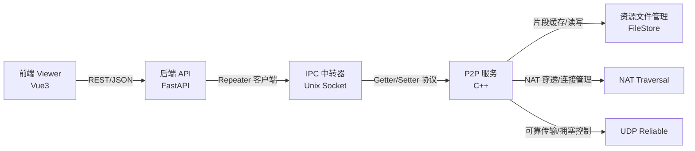
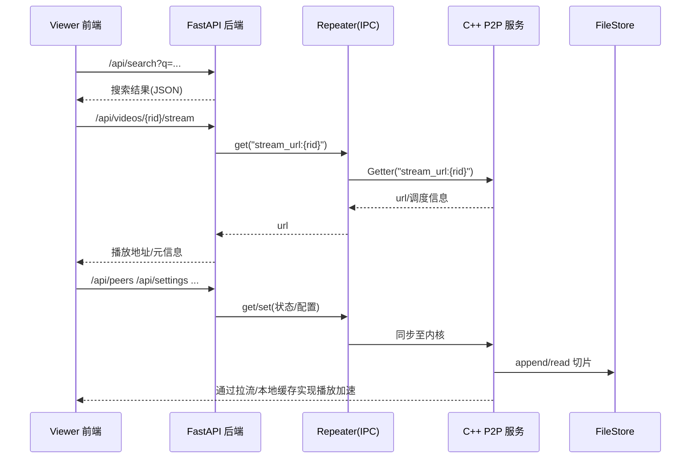

3. 系统设计

本系统旨在构建一套面向视频分发场景的端到端 P2P 加速体系，提供从前端播放、后端编排到本地节点传输及资源管理的完整闭环。系统总体采用“浏览器前端 + Python Web 后端 + C++ P2P 服务 + 进程间中转器”的分层解耦架构，通过 Unix Domain Socket 的轻量 IPC 统一内外部数据面，结合 NAT 穿透与基于 UDP 的可靠传输子系统，形成低时延、可扩展的混合内容分发路径。

系统总体结构如下所示：

数据与控制流程（简化）如下：

3.2 功能模块设计
	自顶向下；

- 前端用户界面（Viewer）
  - 提供首页检索、结果页、播放页、Peer 管理与设置页等交互界面；
  - 通过代理将 `/api/*` 请求路由至 FastAPI；
  - 播放页周期性显示“节点数、上下行速率”等运行状态。
- Web 后端（FastAPI）
  - 提供 `search/videos/peers/history/settings` 等 REST 接口；
  - 启动阶段初始化模拟数据，后续可切换为经由 Repeater 与 P2P 服务交互；
  - 把业务语义稳定暴露给前端，屏蔽底层实现差异。
- IPC 中转器（Repeater）
  - 通过 Unix Domain Socket 收发固定头格式报文，承载 `getter/setter` 两类操作；
  - 维护字段注册中心（FieldRegistry），将字段名映射到具体读写处理；
  - 作为 Python 与 C++ 之间的轻量桥梁，便于扩展字段与演进协议。
- P2P 内核（C++）
  - 负责邻居节点发现与连接维护、分片调度与数据交换；
  - 集成 NAT 穿透与基于 UDP 的可靠传输；
  - 调用本地文件存储实现切片级缓存与淘汰。
- 资源文件管理（FileStore）
  - 以文件为粒度维持元信息（大小、最近修改时间）与使用量；
  - 支持顺序追加、区间读取、容量上限与基于最近修改时间的淘汰；
  - 后台线程定时回收闲置句柄，降低 fd 占用。

3.1.1 用户界面服务设计
	
- 交互与导航
  - 首页 `/index`：搜索入口与常用功能入口（设置、Peer 管理、历史）。
  - 搜索页 `/search?rid=...`：类搜索引擎列表，点击进入播放。
  - 播放页 `/video?rid=...`：简化控制栏与状态栏（0.5s 刷新）。
  - Peer 管理页 `/peer`：顶部运行概览 + 节点列表（可启停）。
  - 历史页 `/history`：记录条目可一键回放进度。
- 数据获取
  - 通过前端 `services/*Api.js` 调用后端 `/api/*` 接口；
  - 状态栏数据（“节点数、下行 MB/s、上行 KB/s”）由后端聚合，来源于 P2P 内核运行时统计，通过 Repeater 提供 getter 字段暴露。
- 鲁棒性设计
  - 前后端松耦合：当 P2P 内核不可用时，后端使用模拟数据兜底，保障可用性与演示性；
  - 接口幂等与前端错误提示，确保播放页与列表页的稳健体验。

3.1.2 进程间数据中转传输
	
- 通信范式
  - 传输介质：Unix Domain Socket（路径默认 `/tmp/p2p_repeater.sock`）。
  - 报文头 `MessageHeader`：`func_type(1B)` + `field(32B)` + `len(4B,BE)`；消息体为原始字节流。
  - 语义：`func_type=1` 为 Getter；`func_type=2` 为 Setter。
- 字段注册与处理
  - C++ 侧通过 `FieldRegistry` 注册字段的 get/set 回调；
  - Python 侧使用 `RepeaterClient` 进行 `_send(func, field, data)`；
  - 典型字段：`peer.count`、`net.down_mbps`、`net.up_kbps`、`stream_url:{rid}`、`cfg.enable_p2p` 等。
- 可扩展性与演进
  - 保持字段名语义稳定并前缀化（`peer.*`、`net.*`、`cfg.*`、`video.*`），便于版本兼容；
  - 长度与编码均在应用层自定义，适配字符串/数值/结构化字节串。

3.1.3 点对点通信模块
	
- 邻居管理与拓扑
  - 维护候选与已连节点集，依据拥塞/延迟/可用带宽动态调整并发连接数；
  - 支持来自 Repeater 的配置注入（如最大并发、上传限速）。
- 分片调度与数据交换
  - 采用区块位图与稀缺度优先策略，兼顾热片段与缺失片段；
  - 容错：失败重试、路径切换与回源拉流预案。
- 与可靠传输、NAT 穿透的协同
  - 在建立连接与数据面选择时，优先使用已打洞成功的直连路径；
  - 对于 UDP 通道，交由“基于 UDP 的可靠通信”子系统保证可靠性与流控。

3.1.4 资源文件管理模块
	
- 存储模型
  - 目录级根路径 + 文件级切片，元信息独立二进制文件维护；
  - 支持 `create/remove/append/read(begin,end)` 与 `get_used_size/get_storage_limit/set_storage_limit`；
  - 按最近修改时间驱动的淘汰策略（近似 LRU）。
- 并发与资源控制
  - 读写互斥保护元信息与句柄表；
  - 后台定时关闭 5s 以上空闲 fd，避免句柄泄漏；
  - 超限写入触发逐文件淘汰直至满足空间需求。

3.1.5 NAT穿透模块
	
- 功能目标
  - 识别自身 NAT 类型并尝试打洞获取可达路径；
  - 维护映射/保活，结合候选对等端进行路径协商。
- 典型流程
  - 与信令/中继（可选）协同完成外网可达性测试；
  - 对称/受限锥形等不同 NAT 策略下选择不同的探测/打洞参数。
- 与系统协作
  - 提供“可用传输通道”候选列表给 P2P 调度层；
  - 通过 Repeater 将自身 NAT 类型上报给后端用于 UI 展示。

3.1.6 基于UDP的可靠通信
	
- 设计目标
  - 在不依赖 TCP 的前提下，为 UDP 提供有序、可靠传输与拥塞控制能力；
  - 面向大文件/长流维持稳定吞吐，降低抖动对播放体验的影响。
- 协议要点
  - 序号与滑动窗口：丢包重传、乱序重组；
  - 超时与快速重传：基于 RTT 估计的自适应重传计时；
  - 拥塞控制：混合慢启动/拥塞避免，拥塞事件触发窗口缩减；
  - 分片与聚合：匹配底层 MTU 并减少系统调用开销。
- 实现联动
  - 与 P2P 调度共享链路质量统计，暴露 `net.down_mbps`/`net.up_kbps` 等指标给 Repeater；
  - 发生拥塞或高丢包时回调调度层降低并发或切换路径。

