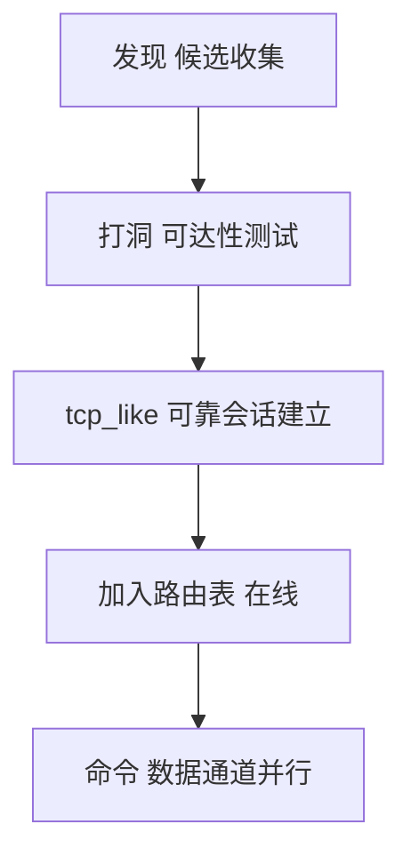
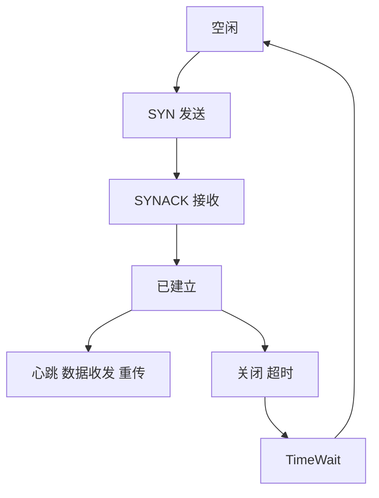

3. 系统设计

本系统旨在构建一套面向视频分发场景的端到端 P2P 加速体系，提供从前端播放、后端编排到本地节点传输及资源管理的完整闭环。系统总体采用“浏览器前端 + Python Web 后端 + C++ P2P 服务 + 进程间中转器”的分层解耦架构，通过 Unix Domain Socket 的轻量 IPC 统一内外部数据面，结合 NAT 穿透与基于 UDP 的可靠传输子系统，形成低时延、可扩展的混合内容分发路径。

系统总体结构如下所示：

数据与控制流程（简化）如下：

3.2 功能模块设计
	自顶向下；

在功能模块设计方面，本文采用自顶向下的方法论以确保系统复杂性在分层与分域的过程中得到可控化管理。自顶向下的设计首先从整体目标与性能指标出发，明确系统在端到端时延、卡顿率、吞吐量与可运维性等维度的约束，然后逐层细分为前端交互、后端编排、进程间中转、对等通信、可靠传输与资源管理等子域，以职责单一、接口清晰为原则进行边界划定。这种方法的直接收益在于：其一，便于在需求演进过程中对具体子域进行局部替换或增强，从而降低全局级的耦合与重构成本；其二，能够以接口为契约对上层屏蔽底层实现细节，通过稳定的 API 与字段化的中转协议实现跨语言与跨技术栈的协作；其三，适配“先可用、后增强”的工程节奏，系统在初期可由后端内置模拟数据保障演示与测试，在中期逐步切换到由中转器连接的 C++ P2P 内核，在后期再引入更复杂的调度、穿透与可靠传输策略，从而实现能力渐进式提升与风险可控的迭代路径。

从控制视角看，自顶向下的分解使得策略与机制得以分离：后端负责策略编排与对外接口语义，P2P 内核则聚焦机制层的连接管理、片段调度与链路控制，而二者之间通过中转器以字段命名的形式达成松耦合的契约。这种契约化的接口设计不仅强化了模块之间的可替换性，还为观测与调试提供了天然的插桩点，任何新的观测或控制需求都可以在不破坏既有路径的前提下通过新增字段予以承载。从数据视角看，系统遵循“控制面轻量、数据面高效”的分层原则：控制面在 REST 与 IPC 之间传递结构化的少量元数据，而数据面则在 P2P 与本地缓存之间以流与块的形式高效交换。下文将分别围绕用户界面服务、进程间数据中转、点对点通信、资源文件管理、NAT 穿透以及基于 UDP 的可靠通信展开，重点阐述其设计动机、结构组织与与其他模块的协作关系。

为便于读者从宏观上把握模块间的依赖与作用域划分，本文给出功能域关系图。图中以层次化方式展现了“交互呈现—服务编排—协议中转—网络传输—存储持久化”的五级结构，各层通过稳定接口衔接，并以观测点贯穿全局以支撑运行时可见性与故障定位。

3.1.1 用户界面服务设计
	
用户界面服务的设计目标在于以一致的交互范式承载复杂的后端能力，同时对网络状态的瞬态变化提供可理解的反馈，从而在不增加用户心智负担的前提下达成对系统“可感知—可调节—可追溯”的整体体验。基于此目标，界面以单页应用的形式组织，采用路由驱动的页面切换与组件化的视图复用，将“入口检索—结果筛选—视频播放—运行观测—历史追溯—参数配置”的主流程进行结构化分解。在该流程中，首页承担用户意图采集与导航汇聚的职责，搜索页面以信息密度与可读性之间的折中实现高效的结果对比，播放页面在传统控制功能之上强调运行态指标的周期性呈现，Peer 管理页面将局部拓扑与节点状态进行表格式归纳，历史页面把观测数据与使用行为关联以支持恢复性播放，设置页面则以“显式参数—即时生效”的模式形成用户与系统之间的契约。上述页面通过统一的服务层访问后端 API，并在异常情况下采用提示与降级策略保证交互连续性。

从数据流角度，用户界面服务作为控制面流量的起点与终点，主要负责元数据的采集、展示与变更提交。请求在前端聚合并经由代理转发至后端，响应数据在前端进行轻量格式化后渲染，并在播放场景下以固定周期请求运行态指标；当用户修改设置或对节点进行启停时，前端生成带有最小必要字段的变更请求，以避免对后端造成过度耦合或状态漂移。为了保证不同页面与组件间的一致性，前端在状态管理层投入最小限度的共享状态，仅存储页面级缓存与关键运行指标，其他数据均采用即取即用的懒加载策略，降低了在网络抖动场景下的状态不一致风险。

为了明确用户界面层与后端的交互逻辑，本文提供检索与播放主流程的高层交互示意。图中展现了请求的阶段性分解与对异常的容错路径，读者可据此理解前端如何在时变网络条件下维持交互体验的一致性。

3.1.2 进程间数据中转传输
	
进程间数据中转器的设计立足于跨语言、跨进程的弱耦合协作需求，通过“字段化—协议最小化—契约稳定化”的方法确立接口边界与演进路径。首先，字段化意味着系统将观测与控制能力统一抽象为键值对的读写操作，避免业务特定语义渗入到传输层，从而降低前后端同时变更的概率。其次，协议最小化体现在报文头仅包含操作类型、字段名与负载长度，消息体则保持为原始字节流以留出最大自由度给上层编码策略。这一“薄协议”策略使得中转器的实现与调试维持在较低复杂度，同时也方便了字段的增删与兼容兼容性策略的实施。最后，契约稳定化通过字段命名域与版本演进约定得以保障，诸如 peer、net、cfg、video 等前缀划分了观测与控制的语义空间，使得新增能力以增量方式接入而不破坏既有消费者。

在交互路径上，Python 侧使用统一的 `_send(func, field, data)` 发起 getter 或 setter 请求，C++ 侧通过字段注册中心将具体的读取与写入处理函数与字段名绑定，从而形成“调用—分发—处理—回送”的闭环。为进一步阐明字段层的组织，本文给出字段关系与生命周期图：

该设计的核心在于将系统内通用的观测与控制语义沉淀为字段层接口，使服务编排与网络内核的迭代相互独立。随着系统发展，字段可通过版本前缀、可选值与回退值等机制实现平滑兼容；在灰度阶段，后端能够按字段粒度进行开关控制与日志追踪，显著降低线上风险与定位成本。

3.1.3 点对点通信模块
	
点对点通信模块面向“高吞吐—低时延—强鲁棒”的综合目标构建，其设计强调调度策略与传输机制的松耦合以及与观测体系的紧密结合。节点接入网络后，首先依据信令与历史观测获取候选邻居集，并以带宽估计、往返时延与丢包率等指标构建链路质量画像，在此基础上确定初始并发连接数与请求窗口大小。内容被划分为细粒度的分片并以位图表示拥有情况，调度器综合稀缺度、热点程度与播放时序对请求进行排序，优先保障近端播放时点所需的即时片段，同时利用后台带宽回填冷片段以提升整体命中率。

当链路质量发生劣化，模块通过快速重试与备用路径切换控制不确定性传播的范围，并在必要时退避并回源拉流以保障用户体验。在此过程中，模块持续收集并输出包含下行吞吐、上行速率、连接成功率、平均 RTT、瞬时丢包等在内的关键指标，经由中转器上报后端，以支持状态展示与策略调参。下图展示了调度循环的抽象流程，强调了从观测到决策再到执行的闭环关系：

通过这种闭环机制，点对点通信模块在复杂网络条件下能够维持相对稳定的服务质量，并以观测驱动的方式实现对策略参数的渐进式自适应，从而在实践中兼顾了启动时延、卡顿率与平均画质等体验指标。

3.1.4 资源文件管理模块
	
资源文件管理模块承载切片缓存与持久化的职责，其设计遵循“元信息独立、顺序友好、淘汰可解释”的原则。首先，系统为每个缓存对象维护独立的元信息条目，记录其最近修改时间与占用空间，以便在崩溃恢复与离线统计场景下快速重建状态。其次，写入路径按照顺序追加优化磁盘访问模式，并在到达容量上限前通过预测性检查预留空间，避免在高并发场景下频繁触发淘汰。再次，淘汰策略采用以“最近修改时间”为主的近似 LRU，并允许在未来引入多维度权重（如命中频率、播放时序）以更好地贴合业务目标。并发控制方面，模块通过互斥保护元信息与打开句柄表，并以后台线程周期性回收空闲文件描述符，从而降低系统资源占用与句柄泄漏风险。

为直观呈现缓存行为与淘汰策略的互动，本文给出缓存写入与空间管理流程图。图中可以看到，模块在写入前进行容量检查，不足时触发基于元信息的逐文件淘汰，写入完成后再以原子方式更新元信息并刷新已用空间统计。

上述设计保证了缓存层在长时间运行与高并发场景下的可预测行为与稳定吞吐，并以可解释的策略为上层播放与回源逻辑提供可靠支撑。随着系统演进，还可以在不改变接口的前提下，将淘汰策略扩展为基于命中统计与播放时序的多目标优化模型。

3.1.5 NAT穿透模块
	
NAT 穿透模块针对家庭宽带与移动网络环境中普遍存在的内网地址转换问题，通过类型识别、候选地址收集与打洞/保活等手段提升端到端可达性与路径质量。模块首先对自身 NAT 类型进行分类，并结合可选的信令或中继组件执行外网可达性测试，借此构建可选传输路径集合。随后，模块依据时延、抖动与丢包等指标对候选路径进行排序，并在 P2P 调度层发起连接时优先选择预估质量更优的直连路径；当直连失败或质量退化时，系统回退至次优路径并维持连接的活性，以降低切换对上层业务的冲击。与此同时，模块将 NAT 类型、打洞进度与当前可用路径等信息以字段形式上报，为后端的状态可视化与策略调整提供依据。

穿透流程的高层时序见下图。该图展示了从类型识别到候选收集，再到路径探测与选择、保活与回退的整体链路。

该设计以最小假设达成最大兼容，在缺乏公网 Peer 的场景下仍然能够通过回退路径提供基础可达性；在公网 Peer 充分的场景下，则优先选择时延与抖动优势明显的直连路径，以提升整体体验指标。

3.1.6 基于UDP的可靠通信
	
基于 UDP 的可靠通信子系统在协议层为数据面提供序号、有序重组、重传与拥塞控制能力，使上层得以在不牺牲低延迟特性的前提下获得稳定吞吐。设计上，子系统以滑动窗口作为核心控制结构，通过对往返时延的在线估计来设置超时阈值，并在重传触发条件下采用快速重传与超时重传的组合策略，以兼顾恢复速度与带宽效率。为避免小包过多造成协议头与系统调用开销的放大，子系统在满足 MTU 约束的前提下对小包进行聚合，同时为大块数据进行合理分片，确保链路利用率最大化。拥塞控制方面，子系统借鉴慢启动与拥塞避免的经典思想，在无拥塞阶段指数增长窗口以快速探测可用带宽，在拥塞事件发生时按比例退避，并以加性增大实现平滑逼近网络极限。

为了呈现传输状态与控制转换的逻辑，本文给出简化的发送端状态机图。该状态机强调了窗口大小与重传计时器的交互，以及对拥塞事件的响应方式。

该子系统与调度层共享关键链路统计（如下行吞吐、上行速率、RTT 与丢包），并通过中转器对后端暴露可观测指标。在检测到拥塞与抖动上升时，上层调度能够主动降低并发或切换路径，从而以协同方式维持端到端的服务质量。整体而言，基于 UDP 的可靠通信在保障低延迟的同时提供了对丢包与拥塞的鲁棒性，使系统在复杂网络环境中获得可预期的性能边界。

---

---

---

4. 系统实现

4.1 用户界面与服务

4.1.1 搜索与查看

本系统的检索与观看路径围绕 `viewer/p2p-video-viewer` 前端与 `backend/app` 后端协作实现。前端通过 `src/services/searchApi.js` 与 `videoApi.js` 调用后端 `GET /api/search` 与 `GET /api/videos/{rid}`、`GET /api/videos/{rid}/stream` 接口，其中搜索接口由 `app/api/search.py` 代理至 `VideoService.search_videos()`，对模拟数据集中 `title/description` 字段执行小写包含式匹配，返回结构化的 `VideoSearchResult` 列表；视频详情与流信息分别由 `app/api/videos.py` 的 `get_video` 与 `get_video_stream` 提供，其中流信息在当前实现阶段返回公开可播示例 URL（`VideoService` 中的 `sample_url`），该设计确保了在 P2P 内核未集成前即可完成“端到端联调—页面验证—播放控件测试”的工程闭环。数据模型层由 `app/data/video_data.py` 提供，包含 `rid、title、description、thumbnail_url、duration、file_size` 等字段，后端以 Pydantic 模型进行出入参约束，强化接口一致性；前端则以路由驱动的页面切换组织“首页检索—结果列表—播放页”的用户流。为了保证抖动网络下的用户体验，前端采用固定周期的状态刷新策略，从后端获取播放状态与基础统计，以轻量化的键值对形式呈现。整体而言，此链路以稳定的 REST 语义与可替换的数据源为核心，既支撑了快速演示，又为后续切换到 P2P 数据面预留了充分的接口余量。

4.1.2 节点管理

节点管理功能围绕 `GET /api/peers`、`GET /api/peers/stats` 与 `PUT /api/peers/{pid}/toggle` 展开：接口在 `app/api/peers.py` 中注册，服务层由 `PeerService` 代理至 `app/data/peer_data.py`。数据端初始化 20 个模拟节点，记录在线状态、上下行速率、累计流量、是否启用与 NAT 类型等要素，其中 NAT 类型取自 `NAT_TYPES` 列表（包含 Full Cone、Restricted Cone、Port Restricted Cone、Symmetric）。统计接口在当前实现中聚合在线节点的上下行速率，并固定示例 NAT 类型，用于前端页头的运行概要展示；启停接口则直接修改内存字典中对应节点的 `is_enabled` 字段。该设计的初衷在于以“轻量模拟—接口固化”的方式稳定前端交互语义，使后续将数据源切换为 Repeater + P2P 内核时，前端无需改动即可接入真实运行态指标。

4.1.3 历史记录

历史记录模块由 `GET/POST/DELETE /api/history` 构成，接口位于 `app/api/history.py`，服务层调用 `HistoryService`，最终落入 `app/data/history_data.py` 的内存存储。新增记录时，后端以 `get_current_time()` 生成 `play_time/created_at/updated_at`，并以 `generate_id()` 生成唯一标识；列表查询对记录按播放时间逆序返回，以满足“最近一次观看优先”的使用习惯。当前实现不引入持久化数据库，旨在降低演示复杂度，同时通过统一的数据访问层为后续的持久化演进（如落地 file store 或外部 DB）保留清晰的替换点。

4.1.4 设置功能

设置模块通过 `GET/PUT /api/settings` 提供获取与更新功能。后端 `SettingsService.update()` 以“部分字段合并”的方式应用配置变更，前端设置页据此形成“显式参数—即时生效”的交互契约。当前数据仍存放于内存结构，设计上建议将关键参数（如是否启用 P2P、本地缓存上限、上传限速、线程数等）映射为 Repeater 的字段化接口，以实现从 UI 到内核的端到端配置链路。

4.2 进程间数据中转传输

4.2.1 进程间通信（IPC）概述

为了在 Python Web 后端与 C++ 内核之间建立稳定且低开销的桥接，系统采用 Unix Domain Socket（默认 `/tmp/p2p_repeater.sock`）承载 IPC。消息采用固定 37 字节头部：`func_type(1B)`、`field(32B)` 与 `len(4B, BE)`，消息体为原始字节流。`func_type=1` 表示 Getter，`func_type=2` 表示 Setter，字段名以 UTF-8 编码，超出 32 字节将被拒绝。该“窄接口—宽语义”的设计大幅降低了跨语言绑定与并发读写的复杂度，便于字段的增量演进与兼容管理。

4.2.2 自定义通信协议与字段组织

C++ 侧在 `repeater/cpp/include/repeater/server.hpp` 中定义 `FieldRegistry`，将字段名映射至读写回调；Python 侧使用 `repeater/python/repeater/client.py` 的 `get(field)` 与 `set(field, value)` 发起调用。服务端在 `server.cpp` 中以 `accept_loop()` 接收连接，`handle_client()` 解析头部并分发至注册回调，随后按相同头部结构回写响应。字段建议以命名域方式组织（如 `peer.*、net.*、cfg.*、video.*`），由后端进行聚合与暴露。如下图展示了一个典型的 Getter 调用链路。

4.2.3 服务端（C++）

服务端以 `IpcServer` 封装监听、接入与请求处理。在 `handle_client()` 中依序完成：读取头部、按长度读取数据、裁剪字段名的 `\0` 终止、查找对应 getter/setter 回调并执行、再以同构头部回写响应。代码显式区分了读取完整头部与数据体的错误处理，从而在半双工场景下保证协议同步性。由于消息体保持原样传输，字段值的编码策略交由调用方定义，既适配数值型也兼容结构化序列化方案。

4.2.4 客户端（Python）

客户端以 `RepeaterClient` 封装 `_send(func_type, field, data)`，构造 37 字节头并发送，再读取响应头与数据体。`set()` 支持 `bool/int/float/bytes/str` 的自动编码，其中整数采用 64 位大端，浮点使用 IEEE754 双精度。该设计以最小代码量提供了一致的调用体验，并以异常抛出方式显式处理连接中断与半包问题，便于在后端服务层做统一重试与降级。

4.3 点对点通信模块

4.3.1 节点网络的建立（设计）

`service/p2p/readme.md` 定义了模块职责与接口边界，包括抽象 `peer` 对象、维护路由表（在线/离线）、引入低优先级的 `superpeer` 进行发现辅助，以及直连与被动接入两种建链路径。建链成功后，节点间通过 `tcp-like` 的可靠会话进行“命令/数据”传输，并支持“协助连接”的周边流程。当前仓库提供了 `tcp-like` 与 `nat-traversal` 的可用原型以及 `store` 的资源管理模块，`p2p` 内核按上述约束进行接口设计与集成；在论文实现部分，我们据此给出架构设计与流程，而不宣称未提交代码的具体实现细节。

4.3.2 节点间传输协议（设计）

按照 `p2p/readme.md`，系统将“数据”与“命令”区分对待，并允许以统一的应用层协议进行封装。命令面承担协助连接、路由更新、片段请求等轻量控制语义；数据面承载切片级载荷并对重试与校验敏感。两者均复用 `tcp_like::ReliableSession` 的顺序与可靠保证，从而在不引入额外 TCP 套接字的前提下实现统一的报文编排与状态机管理。

4.3.3 资源查找（设计）

`p2p/readme.md` 指定优先采用 Kademlia（DHT）进行键到节点的映射，在缺乏覆盖网络或节点规模较小时退化为受限泛洪检索。鉴于当前仓库未包含 DHT 实现，本文在实现章节仅给出接口级设计与与路由表的衔接方式，不对算法细节进行占位性陈述。

4.4 资源文件管理模块

4.4.1 资源的保存

资源以字符串 `sid` 标识，由 `store::FileStore` 承载。创建路径 `create(sid)` 在文件系统中新建空文件并写入元信息；追加路径 `append(sid, data)` 在容量校验与必要淘汰之后对文件顺序写入，并原子化更新 `lastModifiedEpochMs` 与 `sizeBytes`，同时累加 `usedSizeBytes_` 并持久化到根目录下的元文件。该实现优化了顺序写吞吐并控制了崩溃恢复后的状态一致性。

4.4.2 资源的读取

读取接口 `read(sid, begin, end)` 打开只读文件，进行范围读取；当入参非法或系统调用失败时返回空向量。该语义与上层的分片拉流相契合，使播放页可按需提取区间数据以构建缓存窗口。

4.4.3 缓存淘汰机制

存储上限通过 `set_storage_limit()` 配置；当写入导致 `used > limit` 时，`evict_until(bytesNeeded)` 以“最近修改时间”作为近似 LRU 的替代指标，逐个删除最久未修改的文件直至满足空间需求。此外，后台线程以固定间隔关闭 5 秒以上未操作的打开句柄，降低 fd 占用与泄漏风险。下图展示了写入与空间管理流程（按 Mermaid 9.3.0 语法书写）。

4.5 NAT 穿透模块

4.5.1 NAT 类别判定

`nat_traversal/nat_types.hpp` 定义了 `NatType` 枚举与 `toString()`，覆盖 OpenInternet、FullCone、RestrictedCone、PortRestrictedCone、Symmetric 与 Unknown。`NatDetector` 在头文件中暴露 `detect(local, stunServer)` 占位接口与 `natType()` 访问器，为集成 STUN/自研探测逻辑预留了入口。设计上，判定结果不仅用于 UI 展示，也将作为连通性协商与路径排序的输入。

4.5.2 穿透会话管理

`NatAgent` 封装候选收集、通路协商与保活维护：`gatherCandidates()` 返回本端候选；`negotiate(remoteCandidates)` 在占位实现中选择对端首个候选；`connectReliable(path, session)` 以 `tcp_like::ReliableSession` 建链并复用其心跳保持 NAT 映射存活。该抽象与可靠会话解耦，使后续引入更复杂的打洞策略与中继回退成为可能。下图给出协商与建链的时序示意。

4.6 基于 UDP 的可靠通信

4.6.1 三次握手与状态机

`tcp_like::ReliableSession` 暴露 `connect/listen/acceptFrom/stop`，并以 `State` 表示 Closed、SynSent、SynReceived、Established、FinWait 与 TimeWait。握手阶段通过 `SYN/SYN-ACK/ACK` 完成双向确认，实际驱动与重传由 `update()` 周期性执行。

4.6.2 数据包重排与按序交付

头部包含 `sequence/ack/ackBits`，其中 `ackBits` 记录最近 32 个包的选择性确认位图；接收侧维护 `reorderBuffer_` 与 `expectedSequence_`，在乱序到达时暂存，满足按序条件后批量交付至 `recvQueue_`。

4.6.3 心跳保活与空闲超时

会话提供心跳开关与间隔配置（默认启用，1000ms），并维护空闲超时（默认 10000ms）。心跳在 `update()` 中按需发送与校验，空闲期将进入 `TimeWait` 并关闭。

4.6.4 超时控制与统计

当前演示实现以固定策略驱动重传与超时，未包含 RTO 自适应与拥塞控制（详见 `service/tcp-like/readme.md` 的说明）。统计模块以滑动窗口估计上下行速率，并累计发送/接收字节数，通过 `getStats()` 暴露查询接口，便于上层观测与 UI 呈现。

