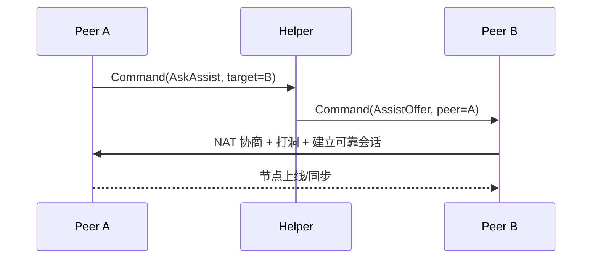
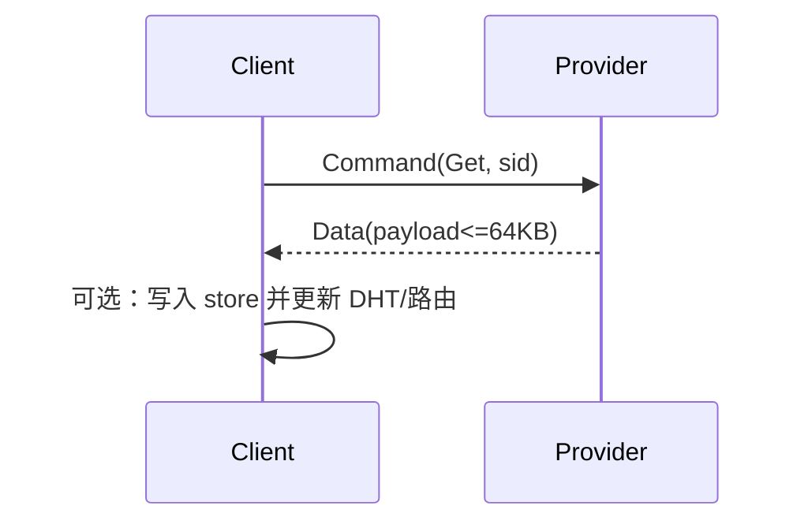

# p2p

设计与实现p2p的核心功能与接口，并且提供main.cpp示例

## 技术栈要求
使用cpp，环境是linux，二进制文件操作。
要用到上一个目录，即service目录下的多个已经实现的模块，包括但不限于nat-traversal, store, tcp-like 这些模块的接口
也允许你对这些模块里的代码进行适当的调整以适应配合当前的p2p模块

## 功能模块需求
* 要抽象出peer这个对象，维护它所需要的信息，例如pid，nat类型，亦或是对某个peer发起通信的接口等

* peer网络建立
两个peer之间使用nat-traversal、tcp-like两模块组合完成nat穿透和基于udp的可靠连接，并以此来相互传输数据和命令（注意，“数据”和“命令”是两种东西，当然你也可以想办法把他们大统一成一种结构来传输，即你可以自定义应用层协议来完成需求）
要维护“peer路由表”，即“当前正与自身连接的有哪些peer”，以及“曾连过 但处于离线的peer”
路由表中存在一个始终认为在线的超级peer，它其实本质上是一个中心化的服务器，但是它只是作为备用的 辅助的，在进行节点发现之类的活动时，superpeer的优先级总是最低的。superpeer继承于peer，重写了“是否在线”或者其他相关的方法。
可以直接对一个peer调用“connect成员函数”尝试直连一个peer，有可能会失败或者成功。成功后会把peer放进已经连接的路由表
可以接收到来自其他peer的连接请求，成功后加入路由表。
连接成功后两个peer通过tcp-like目录下的可靠udp连接来通信。
可以对在线的peer发起“协助我进行内网穿透连接pid（peer id）”的请求，如果协助成功，会传回相关的可用信息，例如对方nat类型，对方穿透成功之后的ip和端口之类的信息
可以收到“协助我连接pid的请求” 此时会检索自己的表里是否存在pid这个peer，有的话就尝试连接，已经处于连接就向该peer发送“请向某某(包含ip 端口 pid等信息)发起连接”的命令
可以收到“请向某某发起连接”的命令，并建立一个新的peer对象尝试连接，成功后放进路由表

* peer间的资源查找（DHT）
使用Kademlia协议

* peer间的数据传输
请求接口 vector<uint_8> getData(string sid, int begin) 
发送接口 int getData(string sid, vector<uint_8> data) 返回成功的字节数

* 资源数据管理存储
标识资源的方式就是一个字符串sid
提供保存新资源的接口 bool createData(string sid, vector<uint_8> data)
该接口一般是在接收到来自peer的资源后，保存本地用的，又或者是上层应用调用，把外部文件保存为资源
获取资源的接口vector<uint_8> findData(string sid) 这个接口里面包含了从本地查找资源、从p2p网络查找资源等逻辑，最终返回结果。

## 项目录结构要求

目录结构清晰，模块划分清晰，接口设计与实现清晰，内外部接口权限划分清晰；
可以适当对其他模块做调整，以适应各个模块间的协作

## 模块实现概述

本目录提供了对等网络内核的一个可运行原型，实现了对等端抽象、路由表管理、DHT 键到节点的简化映射、数据接口与自定义应用层协议。节点间通过 `nat-traversal` 模块进行候选收集与通路协商，并复用 `tcp-like` 的可靠 UDP 会话承载“命令/数据”双通道。模块内部以 `Node` 作为协调者，周期性轮询各会话、分发消息并驱动协助连接与资源请求的闭环，同时以 `store::FileStore` 作为资源存取与本地缓存的统一后端。

目录结构要点：

```text
include/p2p/
  peer.hpp        // Peer/SuperPeer 抽象：连接、在线状态与发送接口
  router.hpp      // RouterTable：在线/离线路由表与 SuperPeer 管理
  dht.hpp         // KademliaTable：简化的键到节点映射
  data_api.hpp    // DataApi：get/put/create/find 与 store 集成
  protocol.hpp    // 轻量应用层协议：命令/数据统一报文头
  node.hpp        // Node 管理器：事件循环、消息分发、协助连接
src/
  peer.cpp router.cpp dht.cpp data_api.cpp protocol.cpp node.cpp
examples/
  main.cpp        // 演示路由/DHT 注册、连接与数据接口调用
```

## 对外接口概览

Peer/SuperPeer

- 连接控制：`bool connect(nat::NatAgent&)`，`void disconnect()`，`bool is_online() const`
- 发送接口：`bool send_command(const std::vector<uint8_t>&)`，`bool send_data(const std::vector<uint8_t>&)`

RouterTable

- 拓扑维护：`set_superpeer(std::shared_ptr<SuperPeer>)`，`upsert_online(std::shared_ptr<Peer>)`，`mark_offline(pid)`
- 查询接口：`get(pid)`，`list_online()`，`list_offline()`

KademliaTable（简化）

- 节点注册：`add_node(const KNode&)`
- 相近查找：`find_closest(const Key160& key, std::size_t k)`

DataApi

- 读取请求：`std::vector<uint8_t> getData(const std::string& sid, int begin)`
- 写入请求：`int putData(const std::string& sid, const std::vector<uint8_t>& data)`
- 本地创建：`bool createData(const std::string& sid, const std::vector<uint8_t>& data)`
- 综合查找：`std::vector<uint8_t> findData(const std::string& sid)`（包含 DHT/网络回退逻辑的入口）

Node 管理器

- 生命周期：`void start()`，`void stop()`
- 协助连接：`bool request_assist(const std::string& helperPid, const std::string& targetPid)`
- 资源请求：`bool request_get(const std::string& pid, const std::string& sid)`

## 应用层协议

协议以固定 8 字节头封装命令与数据。`MsgHeader{ type(1) | code(1) | rsv(2) | len(4, BE) }`，其后接 `len` 字节负载。`type ∈ {Command, Data}`；命令码 `code` 取值包含 `Hello`、`AskAssist`、`AssistOffer`、`Get`、`Put`。序列化/反序列化由 `p2p/protocol.hpp` 提供的 `pack_cmd/pack_data/unpack` 完成。

一个典型的“协助连接”时序如下：



数据请求与回包示意：



## 构建与示例

在 `service` 目录构建：

```bash
cmake -S . -B build -DCMAKE_BUILD_TYPE=Release
cmake --build build -j
```

示例程序位于 `service/p2p/examples/main.cpp`，演示 SuperPeer 设置、路由/DHT 注册、NatAgent 启动、Peer 连接与 DataApi 的基本调用。库目标 `p2p` 依赖 `tcp_like_udp`、`nat_traversal`、`store`，并链接 `OpenSSL::Crypto` 以支持 SHA1。
